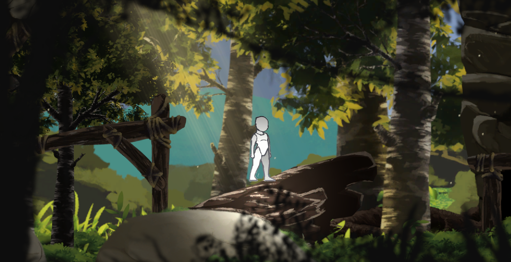
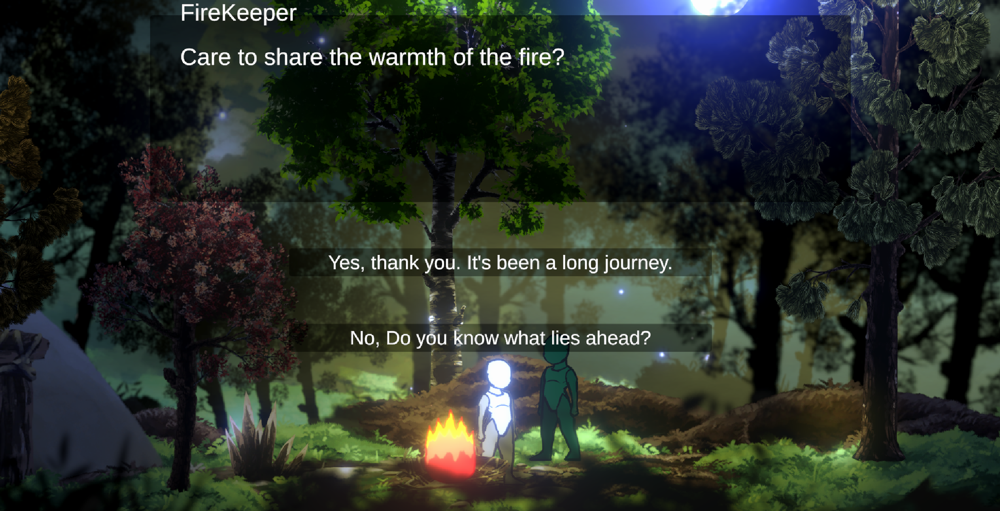
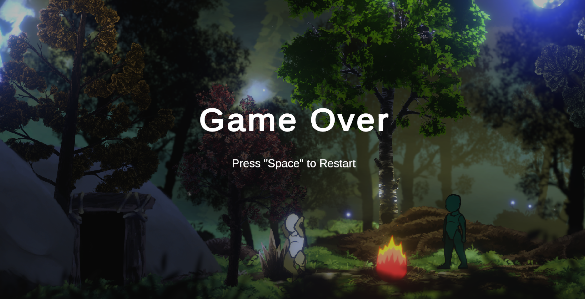

# Vonder Unity Assignment

This project is a 2D platformer developed using Unity's 2D Universal Render Pipeline and the new Input System. The game features a variety of mechanics, interactive elements, and visual effects that showcase proficiency in Unity development.

## Features

### Stage 1: Core Mechanics

- **Character Movement**
  - Move using **W/A/S/D** keys or a **controller (joystick/gamepad)**.
- **Jumping**
  - Press **Space** to jump.
  - **Hold** Space to jump higher; **tap** for a shorter jump.
- **Dashing**
  - Press **Shift** to dash forward with an exponential speed curve (high initial speed decreasing over time).
  - Mid-air dashing propels the character forward without descending until the dash concludes.
- **Shooting**
  - **Left-click** to shoot bullets that disappear upon hitting objects.
  - Implemented using an **object pooling** system for efficiency.
- **One-Way Platforms** *(Extra)*
  - Stand on top but can jump through from below.
- **Particle Effects** *(Extra)*
  - Particles are generated when jumping, dashing, and shooting.

### Stage 2: Scene Interaction

- **Door Mechanics**
  - Interact with doors by pressing **E** or walking into them to change scenes.
  - The main character persists across scenes without being destroyed or recreated.
  - **Bi-directional Travel** between Scene A and Scene B.
- **NPC Interaction**
  - In Scene B, press **E** to interact with an NPC or object.
  - Dialogue appears on the canvas in a custom UI.

### Stage 3: Environmental Lighting

- **Scene A**
  - Set during **daytime** with appropriate lighting.
- **Scene B**
  - Set during **nighttime** with ambient lighting.
- **Campfire Particle Effect** *(Extra)*
  - Added a campfire next to the NPC in Scene B for enhanced ambiance.

### Stage 4: Checkpoints and Health System

- **Respawn System**
  - **Falling Deaths**
    - Respawn on the left checkpoint if falling off the left side.
    - Respawn on the right checkpoint if falling off the right side.
  - **Spike Traps**
    - Colliding with spikes reduces health and respawns the character at the last checkpoint.
- **Health System**
  - Total health of **100 HP**.
  - **Lose 20 HP** upon each death.
  - **HP Bar** reflects the current health status.
- **Game Over Screen**
  - Displays when HP reaches **0**.
  - Press **Space** to reset the game to its initial state.

### Extra Assignments

- **Reflective Water**
  - Created water with reflection effects similar to *Core Keeper* using shaders or a secondary camera.
- **Parallax Scrolling**
  - Implemented a parallax system for backgrounds to move at varying speeds, creating depth.

## Screenshots

Here are some in-game screenshots showcasing various aspects of the game:

- **Scene A - Daytime**

  

- **Scene B - Nighttime with Campfire and Dialogue**

  

- **Game Over Screen**

  

## Controls

- **Move**: `W` / `A` / `S` / `D` or Controller Joystick
- **Jump**: `Space` (hold for higher jump)
- **Dash**: `Shift`
- **Shoot**: `Left Mouse Click`
- **Interact**: `E`

## Installation and Setup

1. **Clone the Repository**

   ```bash
   git clone https://github.com/MajorTom3K1M/vonder-unity-assignment.git
   ```

2. **Open in Unity**

   - Ensure you have Unity installed (recommended version compatible with 2D URP).
   - Open the project through the Unity Hub or Unity Editor.

3. **Play the Game**

   - Press the **Play** button in the Unity Editor to start the game.